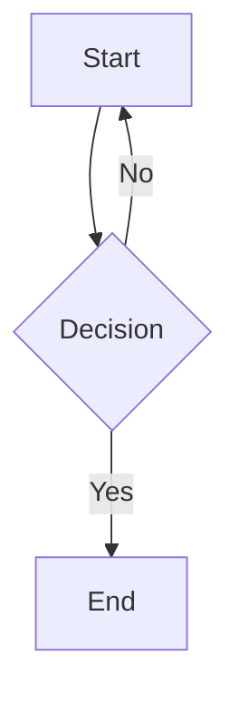
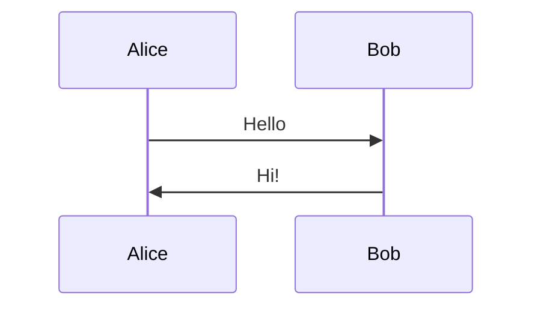
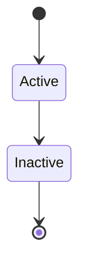
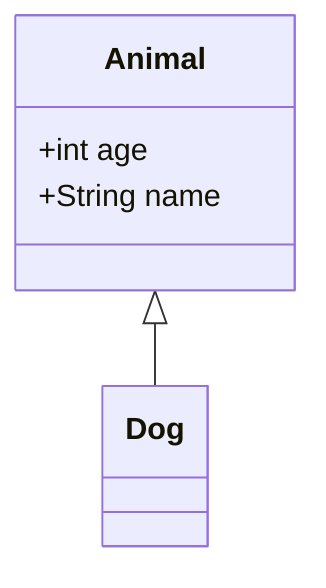
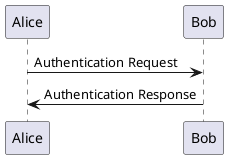

# API Documentation

## Base URL

**Local Development**: `http://localhost:3000`  
**Production**: `https://your-app.railway.app`

## Endpoints

### 1. Health Check

Check if the service is running.

**Endpoint**: `GET /api/health`

**Response** (200 OK):
```json
{
  "success": true,
  "status": "healthy",
  "service": "document-viz-pipeline",
  "version": "1.0.0",
  "timestamp": "2025-11-09T12:00:00.000Z",
  "environment": "production",
  "uptime": 3600
}
```

**Example**:
```bash
curl http://localhost:3000/api/health
```

---

### 2. Upload Document

Upload and process a document with visualization code.

**Endpoint**: `POST /api/upload`

**Content-Type**: `multipart/form-data`

**Request Parameters**:
| Parameter | Type | Required | Description |
|-----------|------|----------|-------------|
| file | File | Yes | Document file (PDF, DOCX, MD, TXT) |

**File Requirements**:
- Maximum size: 10MB
- Allowed formats: `.pdf`, `.docx`, `.md`, `.txt`
- Must contain at least one Mermaid or PlantUML code block

**Success Response** (200 OK):
```json
{
  "success": true,
  "fileId": "a1b2c3d4-e5f6-7890-abcd-ef1234567890",
  "downloadUrl": "/api/download/a1b2c3d4-e5f6-7890-abcd-ef1234567890",
  "processedAt": "2025-11-09T12:00:00.000Z",
  "visualizationsFound": 3,
  "visualizationsRendered": 3,
  "fileSize": 2048576,
  "fileSizeMB": "1.95",
  "numPages": 5,
  "processingTimeMs": 15420,
  "searchable": true
}
```

**Error Responses**:

**400 Bad Request** - Invalid file:
```json
{
  "success": false,
  "error": "Invalid file extension. Allowed: .pdf, .docx, .md, .txt",
  "fileId": null
}
```

**413 Payload Too Large** - File too large:
```json
{
  "success": false,
  "error": "File too large. Maximum size: 10MB",
  "fileId": null
}
```

**422 Unprocessable Entity** - No visualization code:
```json
{
  "success": false,
  "error": "No visualization code blocks found in document",
  "message": "Please ensure your document contains Mermaid or PlantUML code blocks wrapped in ``` markers",
  "fileId": "a1b2c3d4-e5f6-7890-abcd-ef1234567890"
}
```

**500 Internal Server Error** - Processing failed:
```json
{
  "success": false,
  "error": "Mermaid rendering failed: Invalid syntax",
  "fileId": "a1b2c3d4-e5f6-7890-abcd-ef1234567890"
}
```

**Example (cURL)**:
```bash
curl -X POST http://localhost:3000/api/upload \
  -F "file=@/path/to/document.md"
```

**Example (JavaScript/Fetch)**:
```javascript
const formData = new FormData();
formData.append('file', fileInput.files[0]);

const response = await fetch('http://localhost:3000/api/upload', {
  method: 'POST',
  body: formData
});

const result = await response.json();
console.log(result);
```

**Example (Python)**:
```python
import requests

with open('document.md', 'rb') as f:
    files = {'file': f}
    response = requests.post('http://localhost:3000/api/upload', files=files)
    result = response.json()
    print(result)
```

---

### 3. Download Processed PDF

Download the processed PDF file.

**Endpoint**: `GET /api/download/:fileId`

**URL Parameters**:
| Parameter | Type | Required | Description |
|-----------|------|----------|-------------|
| fileId | String (UUID) | Yes | File ID from upload response |

**Success Response** (200 OK):
- Content-Type: `application/pdf`
- Content-Disposition: `attachment; filename="processed-{fileId}.pdf"`
- Body: Binary PDF data

**Error Responses**:

**404 Not Found** - File expired or doesn't exist:
```json
{
  "success": false,
  "error": "File not found or has expired"
}
```

**500 Internal Server Error** - Download failed:
```json
{
  "success": false,
  "error": "Failed to download file"
}
```

**Example (cURL)**:
```bash
curl http://localhost:3000/api/download/a1b2c3d4-e5f6-7890-abcd-ef1234567890 \
  -o output.pdf
```

**Example (JavaScript)**:
```javascript
const fileId = 'a1b2c3d4-e5f6-7890-abcd-ef1234567890';
const response = await fetch(`http://localhost:3000/api/download/${fileId}`);
const blob = await response.blob();

// Trigger download
const url = window.URL.createObjectURL(blob);
const a = document.createElement('a');
a.href = url;
a.download = 'processed.pdf';
a.click();
```

**Example (Python)**:
```python
import requests

file_id = 'a1b2c3d4-e5f6-7890-abcd-ef1234567890'
response = requests.get(f'http://localhost:3000/api/download/{file_id}')

with open('output.pdf', 'wb') as f:
    f.write(response.content)
```

---

## Rate Limiting

Currently no rate limiting is implemented. For production use, consider adding rate limiting middleware.

## File Retention

Uploaded and processed files are automatically deleted after **1 hour** (configurable in `src/config/config.js`).

## Supported Visualization Formats

### Mermaid

All Mermaid diagram types are supported:

**Flowchart**:
````markdown

````

**Sequence Diagram**:
````markdown

````

**State Diagram**:
````markdown

````

**Class Diagram**:
````markdown

````

### PlantUML

Basic PlantUML diagrams are supported:

**Markdown Style**:
````markdown

````

**Simplified**:
````markdown
```plantuml
Alice -> Bob: Hello
Bob -> Alice: Hi!
```
````

---

## Error Handling

All endpoints return consistent error responses:

```json
{
  "success": false,
  "error": "Human-readable error message",
  "fileId": "optional-file-id-if-available"
}
```

HTTP Status Codes:
- `200` - Success
- `400` - Bad Request (invalid input)
- `404` - Not Found
- `413` - Payload Too Large
- `422` - Unprocessable Entity (no visualizations found)
- `500` - Internal Server Error

---

## Webhooks (Future Feature)

Webhook support is planned for future releases to notify clients when processing completes.

## Authentication (Future Feature)

Currently no authentication is required. API key authentication is planned for production deployments.

---

## Client Libraries

### Node.js Example Client

```javascript
const FormData = require('form-data');
const fs = require('fs');
const axios = require('axios');

class DocumentVizClient {
  constructor(baseUrl = 'http://localhost:3000') {
    this.baseUrl = baseUrl;
  }

  async uploadDocument(filePath) {
    const form = new FormData();
    form.append('file', fs.createReadStream(filePath));

    const response = await axios.post(`${this.baseUrl}/api/upload`, form, {
      headers: form.getHeaders()
    });

    return response.data;
  }

  async downloadPDF(fileId, outputPath) {
    const response = await axios.get(`${this.baseUrl}/api/download/${fileId}`, {
      responseType: 'arraybuffer'
    });

    fs.writeFileSync(outputPath, response.data);
    return outputPath;
  }

  async processDocument(inputPath, outputPath) {
    const uploadResult = await this.uploadDocument(inputPath);
    if (uploadResult.success) {
      await this.downloadPDF(uploadResult.fileId, outputPath);
      return { success: true, ...uploadResult };
    }
    throw new Error(uploadResult.error);
  }
}

// Usage
const client = new DocumentVizClient();
client.processDocument('input.md', 'output.pdf')
  .then(result => console.log('Success:', result))
  .catch(err => console.error('Error:', err));
```

---

## Support

For API questions or issues:
- Open an issue on GitHub
- Check the integration tests in `tests/integration.test.js` for examples
- Review the source code in `src/routes/`
