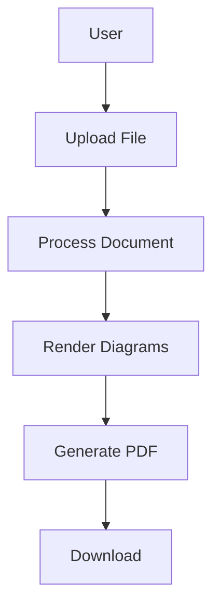

# 🚀 Deploy to Railway - Quick Guide

## Step 1: Initialize Git Repository

```powershell
# Navigate to project directory
cd C:\document-viz-pipeline

# Initialize git
git init

# Stage all files
git add .

# Commit
git commit -m "Initial commit: Document Visualization Pipeline"
```

## Step 2: Create GitHub Repository

1. Go to https://github.com/new
2. Repository name: `document-viz-pipeline`
3. Description: "Automatically convert visualization code in documents to rendered images"
4. **Keep it Public** (or Private if you prefer)
5. **DO NOT** initialize with README, .gitignore, or license (we already have these)
6. Click **Create repository**

## Step 3: Push to GitHub

```powershell
# Add remote (replace YOUR_USERNAME with your GitHub username)
git remote add origin https://github.com/YOUR_USERNAME/document-viz-pipeline.git

# Push to GitHub
git branch -M main
git push -u origin main
```

If prompted for credentials:
- Username: Your GitHub username
- Password: Use a **Personal Access Token** (not your password)
  - Generate token at: https://github.com/settings/tokens
  - Select scope: `repo` (full control of private repositories)

## Step 4: Deploy on Railway

### 4.1 Create Railway Account
1. Go to https://railway.app/
2. Sign up with GitHub (recommended)
3. Authorize Railway to access your repositories

### 4.2 Create New Project
1. Click **"New Project"**
2. Select **"Deploy from GitHub repo"**
3. Choose your `document-viz-pipeline` repository
4. Railway will automatically detect the Dockerfile

### 4.3 Configure Environment Variables
1. In Railway dashboard, go to your project
2. Click **"Variables"** tab
3. Add these variables:
   ```
   NODE_ENV=production
   PORT=3000
   ```
4. Click **"Save"**

### 4.4 Deploy
1. Railway will automatically start building and deploying
2. Wait for deployment to complete (~5-10 minutes first time)
3. Look for "Deployment successful" message

### 4.5 Get Your Public URL
1. Go to **"Settings"** tab
2. Under **"Domains"**, click **"Generate Domain"**
3. Railway will create a public URL like:
   ```
   https://document-viz-pipeline-production.up.railway.app
   ```
4. Copy this URL - this is your live application!

## Step 5: Test Your Deployment

### Test Health Check
Open in browser or use curl:
```
https://your-app-url.railway.app/api/health
```

Should return:
```json
{
  "success": true,
  "status": "healthy",
  "service": "document-viz-pipeline"
}
```

### Test Upload Interface
1. Open your Railway URL in browser
2. You'll see the upload interface
3. Upload a markdown file with Mermaid code
4. Download the processed PDF

## 📝 Sample Test File

If you don't have a test file, create this:

**test-diagram.md**
````markdown
# Test Document

## Architecture Diagram



This is a test document with a simple Mermaid diagram.
````

## ⚠️ Important Notes

### Deployment Time
- First deployment: 5-10 minutes (downloads Chromium)
- Subsequent deployments: 2-5 minutes

### Monitoring
- Railway provides logs in the **"Deployments"** tab
- Monitor CPU/Memory usage in **"Metrics"** tab
- Check health endpoint regularly

### Free Tier Limits
Railway free tier includes:
- $5 credit per month
- Should be sufficient for testing/demo
- Upgrade to "Hobby" plan ($5/month) for production

### Cold Starts
- Railway may sleep inactive apps after 15 minutes
- First request after sleep takes 10-20 seconds
- Keep-alive pings can prevent this (future feature)

## 🔧 Troubleshooting Railway Deployment

### Build Failed
**Check build logs**:
1. Go to **"Deployments"** tab
2. Click on failed deployment
3. View build logs
4. Common issues:
   - Docker build timeout: Increase resources
   - Network issues: Retry deployment

### Deployment Succeeded but App Not Working
**Check runtime logs**:
1. Go to **"Deployments"** tab
2. Click on current deployment
3. View runtime logs
4. Look for errors like:
   - Port binding issues
   - Missing dependencies
   - Puppeteer errors

### Puppeteer/Chromium Issues
The Dockerfile includes all necessary Chromium dependencies:
```dockerfile
RUN apk add --no-cache \
    chromium \
    nss \
    freetype \
    harfbuzz
```

If issues persist, check Railway logs for specific errors.

### Memory Issues
If you see "Out of memory" errors:
1. Go to **"Settings"** tab
2. Adjust memory limits
3. Or upgrade to higher tier

## 🎯 Success Checklist

Before considering deployment complete:

- [ ] Git repository initialized
- [ ] Code pushed to GitHub
- [ ] Railway project created
- [ ] Deployment completed successfully
- [ ] Public URL generated
- [ ] Health check returns 200
- [ ] Upload interface loads
- [ ] Test file processes successfully
- [ ] PDF downloads correctly
- [ ] PDF is searchable

## 📊 Post-Deployment

### Share Your App
Your application is now live! Share the URL:
```
https://your-app-url.railway.app
```

### Monitor Usage
Check Railway dashboard for:
- Number of requests
- Processing time
- Memory usage
- Error rates

### Update Application
To deploy updates:
```powershell
# Make changes to code
git add .
git commit -m "Description of changes"
git push

# Railway automatically redeploys!
```

## 🔐 Security Recommendations

For production use, consider adding:
1. **API Key Authentication**
2. **Rate Limiting**
3. **File Size Limits** (already set to 10MB)
4. **CORS Configuration** (already included)
5. **HTTPS** (Railway provides this automatically)

## 💰 Cost Estimate

Typical usage on Railway:
- **Free tier**: ~100-200 document conversions/month
- **Hobby ($5/month)**: ~1000-2000 conversions/month
- Depends on document complexity and diagram count

## 📞 Support

If you encounter issues:
1. Check Railway logs
2. Review GitHub repository
3. Check Railway status: https://status.railway.app/
4. Railway Discord: https://discord.gg/railway

---

## Quick Command Summary

```powershell
# Setup Git
cd C:\document-viz-pipeline
git init
git add .
git commit -m "Initial commit: Document Visualization Pipeline"

# Push to GitHub (replace YOUR_USERNAME)
git remote add origin https://github.com/YOUR_USERNAME/document-viz-pipeline.git
git branch -M main
git push -u origin main

# Then deploy via Railway dashboard
# https://railway.app/new
```

---

**That's it! Your application will be live on Railway in minutes.** 🚀
