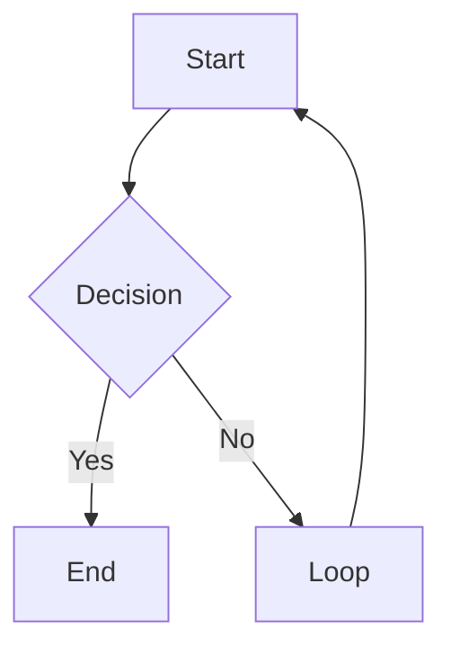
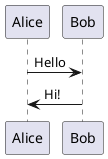

# 📊 Document Visualization Pipeline

> Automatically convert embedded visualization code (Mermaid, PlantUML) in research documents into rendered images, outputting a clean, searchable PDF.

[](https://nodejs.org/)
[](LICENSE)

## ✨ Features

- ✅ **Multi-Format Support**: Process PDF, DOCX, Markdown, and TXT files
- ✅ **Automatic Detection**: Identifies Mermaid and PlantUML code blocks
- ✅ **High-Quality Rendering**: Converts code to PNG images via Puppeteer
- ✅ **Searchable PDFs**: Generates PDFs with preserved text layers (not image-based)
- ✅ **Clean Output**: Removes all code artifacts from final document
- ✅ **Structure Preservation**: Maintains document formatting and hierarchy
- ✅ **Easy Deployment**: Docker-ready with Railway configuration

## 🎯 Use Cases

- Convert technical documentation with diagrams to presentation-ready PDFs
- Prepare research papers with embedded visualizations for publication
- Generate client-ready reports from Markdown notes
- Archive documents with rendered visualizations

## 🚀 Quick Start

### Prerequisites

- Node.js 18 or higher
- npm or yarn

### Installation

```bash
# Clone the repository
git clone https://github.com/yourusername/document-viz-pipeline.git
cd document-viz-pipeline

# Install dependencies
npm install

# Create environment file
cp .env.example .env

# Start development server
npm run dev
```

The application will be available at `http://localhost:3000`

## 📖 Usage

### Web Interface

1. Open the web interface in your browser
2. Drag and drop or select your document (PDF, DOCX, MD, or TXT)
3. Wait for processing (typically 10-30 seconds)
4. Download your rendered PDF automatically

### Supported Code Block Formats

**Mermaid:**
````markdown

````

**PlantUML:**
````markdown

````

Or simply:
````markdown
```plantuml
Alice -> Bob: Authentication Request
Bob -> Alice: Authentication Response
```
````

### API Documentation

#### POST `/api/upload`

Upload and process a document.

**Request:**
- Method: `POST`
- Content-Type: `multipart/form-data`
- Body: `file` (binary)

**Response:**
```json
{
  "success": true,
  "fileId": "uuid-here",
  "downloadUrl": "/api/download/uuid-here",
  "processedAt": "2025-11-09T...",
  "visualizationsFound": 3,
  "visualizationsRendered": 3,
  "fileSize": 2048576,
  "fileSizeMB": "1.95",
  "numPages": 5,
  "processingTimeMs": 15420,
  "searchable": true
}
```

#### GET `/api/download/:fileId`

Download the processed PDF.

**Response:**
- Content-Type: `application/pdf`
- Body: PDF file binary

#### GET `/api/health`

Health check endpoint for monitoring.

**Response:**
```json
{
  "success": true,
  "status": "healthy",
  "service": "document-viz-pipeline",
  "version": "1.0.0",
  "timestamp": "2025-11-09T...",
  "environment": "production",
  "uptime": 3600
}
```

## 🏗️ Architecture

```
document-viz-pipeline/
├── src/
│   ├── server.js              # Express server
│   ├── routes/                # API endpoints
│   ├── services/              # Business logic
│   │   ├── documentParser.js  # Parse documents
│   │   ├── codeDetector.js    # Find code blocks
│   │   ├── visualRenderer.js  # Render to images
│   │   ├── documentReconstructor.js  # Rebuild documents
│   │   └── pdfGenerator.js    # Generate PDFs
│   ├── utils/                 # Utilities
│   └── config/                # Configuration
├── public/                    # Frontend
├── tests/                     # Integration tests
└── Dockerfile                 # Container config
```

## 🐳 Docker Deployment

### Build and Run Locally

```bash
# Build Docker image
docker build -t document-viz-pipeline .

# Run container
docker run -p 3000:3000 document-viz-pipeline
```

### Railway Deployment

1. **Push to GitHub:**
```bash
git init
git add .
git commit -m "Initial commit"
git remote add origin https://github.com/yourusername/document-viz-pipeline.git
git push -u origin main
```

2. **Deploy on Railway:**
   - Connect your GitHub repository to Railway
   - Railway will automatically detect the Dockerfile
   - Set environment variables:
     - `NODE_ENV=production`
     - `PORT=3000`
   - Deploy!

3. **Environment Variables:**
   - `PORT`: Server port (default: 3000)
   - `NODE_ENV`: Environment (development/production)
   - `PUPPETEER_EXECUTABLE_PATH`: Path to Chromium (set automatically in Docker)

## 🧪 Testing

```bash
# Run all tests
npm test

# Run with coverage
npm test -- --coverage
```

### Test Files

- `tests/integration.test.js`: Full integration tests
- `tests/fixtures/sample.md`: Sample Markdown with Mermaid

## 📊 Performance

- **Average Processing Time**: 15-30 seconds
- **Max File Size**: 10MB
- **Supported Formats**: PDF, DOCX, MD, TXT
- **Concurrent Users**: Handles multiple uploads simultaneously
- **Memory Usage**: ~200MB base + ~100MB per active render

## 🛠️ Development

### Project Structure

- **Services**: Modular business logic for each processing step
- **Routes**: RESTful API endpoints
- **Utils**: Helper functions (logging, validation, file management)
- **Config**: Centralized configuration

### Key Technologies

- **Backend**: Node.js, Express.js
- **PDF Processing**: pdf-lib, pdfjs-dist
- **Document Parsing**: mammoth (DOCX), markdown-it (MD)
- **Rendering**: Puppeteer (headless Chrome)
- **Visualization**: Mermaid.js, PlantUML

### Adding New Visualization Types

1. Add detection pattern in `src/services/codeDetector.js`
2. Implement renderer in `src/services/visualRenderer.js`
3. Update validation and tests

## 📝 Configuration

Edit `src/config/config.js` to customize:

- File upload limits
- Rendering dimensions and DPI
- PDF generation settings
- Cleanup schedules
- Puppeteer options

## 🐛 Troubleshooting

### Puppeteer Issues

If Puppeteer fails to launch:
```bash
# On Linux
sudo apt-get install -y chromium-browser

# Set environment variable
export PUPPETEER_EXECUTABLE_PATH=/usr/bin/chromium-browser
```

### Memory Issues

For large files, increase Node.js memory:
```bash
node --max-old-space-size=4096 src/server.js
```

### PDF Not Searchable

Ensure Puppeteer generates text-based PDFs:
- Check `page.pdf()` options in `pdfGenerator.js`
- Verify fonts are properly embedded
- Test text extraction with pdfjs-dist

## 🤝 Contributing

Contributions are welcome! Please:

1. Fork the repository
2. Create a feature branch
3. Commit your changes
4. Push to the branch
5. Open a Pull Request

## 📄 License

This project is licensed under the MIT License - see the [LICENSE](LICENSE) file for details.

## 🙏 Acknowledgments

- [Mermaid.js](https://mermaid.js.org/) - Diagram generation
- [PlantUML](https://plantuml.com/) - UML diagrams
- [Puppeteer](https://pptr.dev/) - Headless browser automation
- [pdf-lib](https://pdf-lib.js.org/) - PDF manipulation

## 📧 Support

For issues and questions:
- Open an issue on GitHub
- Check existing documentation
- Review integration tests for examples

## 🗺️ Roadmap

- [ ] Support for additional diagram types (D3.js, Graphviz)
- [ ] Batch processing multiple files
- [ ] Custom styling options for diagrams
- [ ] API authentication
- [ ] Webhook notifications
- [ ] Progress tracking via WebSocket

---

**Built with ❤️ for better document processing**
