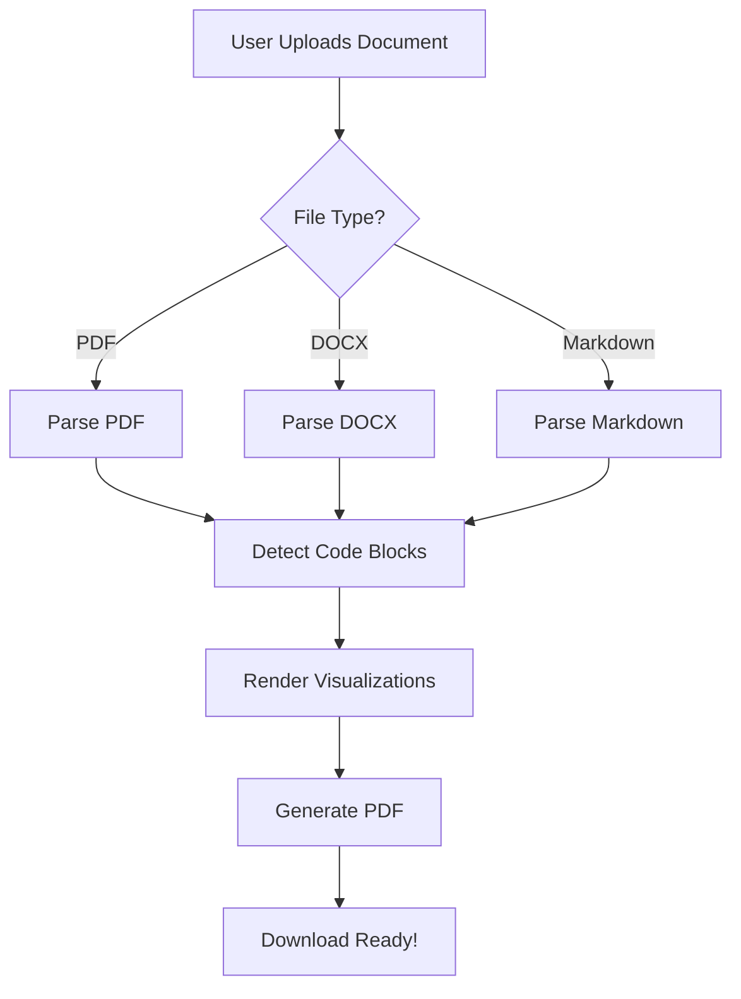
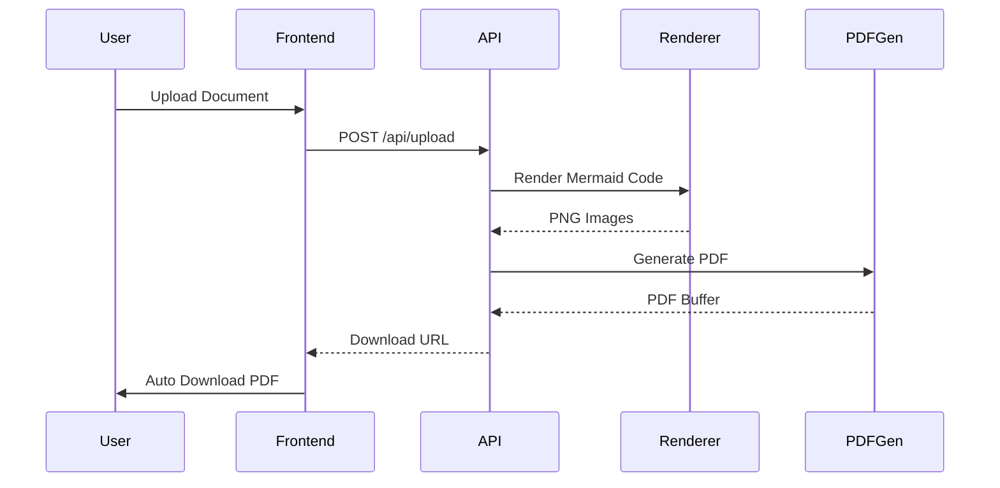
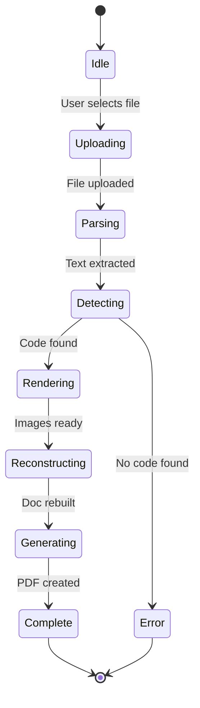
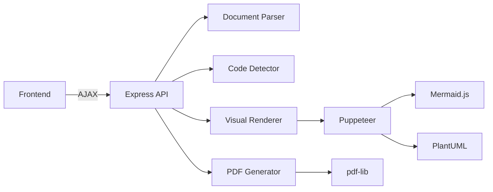

# Test Document for Visualization Pipeline

This document contains Mermaid diagrams that will be converted to images.

## System Architecture

Here's a flowchart showing the document processing flow:

## User Journey

This sequence diagram shows the interaction between components:

## Application States

Here's a state diagram of the processing workflow:

## Technology Stack

## Conclusion

After processing, this document will have all the Mermaid code blocks replaced with rendered images, and the output will be a searchable PDF!
