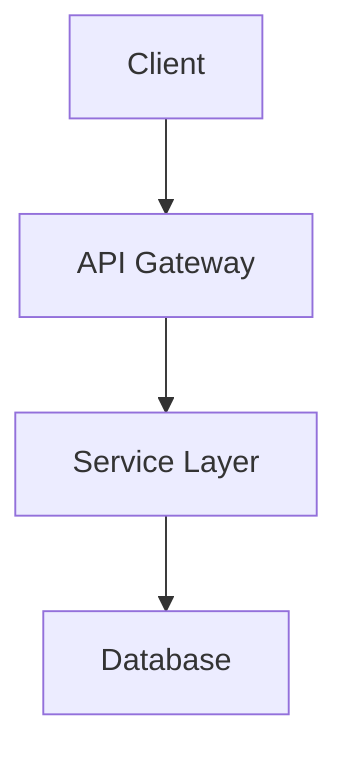
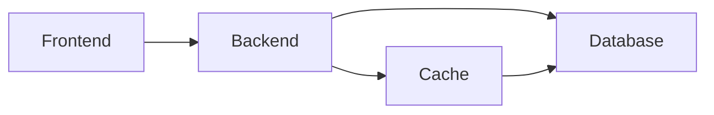

# Research Document - Mixed Format Diagrams

This document contains Mermaid diagrams in different formats.

## Architecture Overview (Standard Format)

## System Flow (Plain Format Without Backticks)

mermaid
sequenceDiagram
    participant User
    participant System
    participant Database
    
    User->>System: Submit Request
    System->>Database: Query Data
    Database-->>System: Return Results
    System-->>User: Display Response

## Processing States

This diagram shows the state machine without backticks:

mermaid
stateDiagram-v2
    [*] --> Idle
    Idle --> Processing
    Processing --> Complete
    Processing --> Error
    Complete --> [*]
    Error --> [*]

## Component Architecture (Standard Format)

## Data Pipeline

mermaid
flowchart TB
    Input[Data Input] --> Validate[Validation]
    Validate --> Process[Processing]
    Process --> Store[Storage]
    Store --> Output[Output]

## Summary

This document demonstrates that the system can handle:
1. Mermaid code with triple backticks (standard markdown)
2. Mermaid code without backticks (plain format)
3. Mixed formats in the same document
