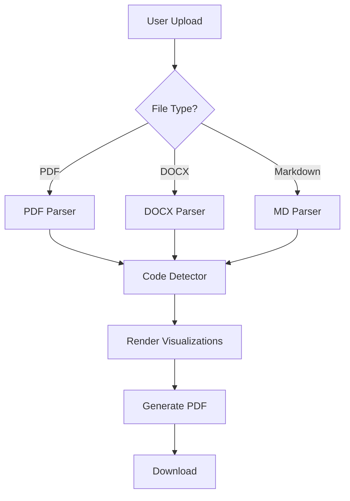
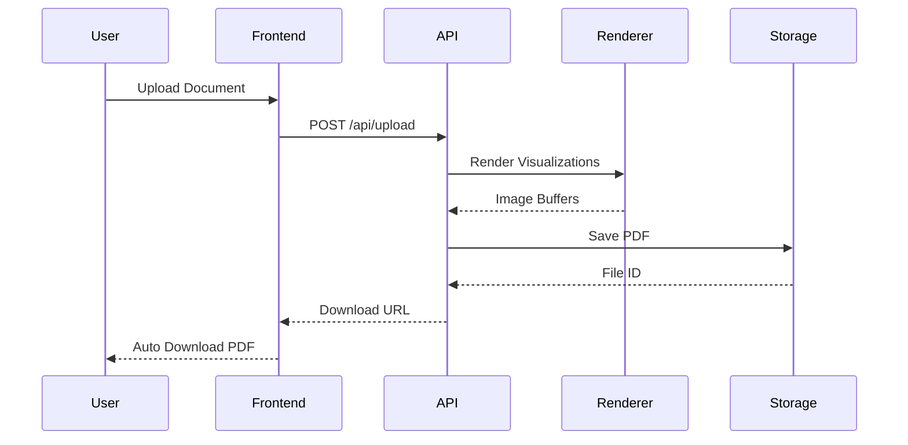
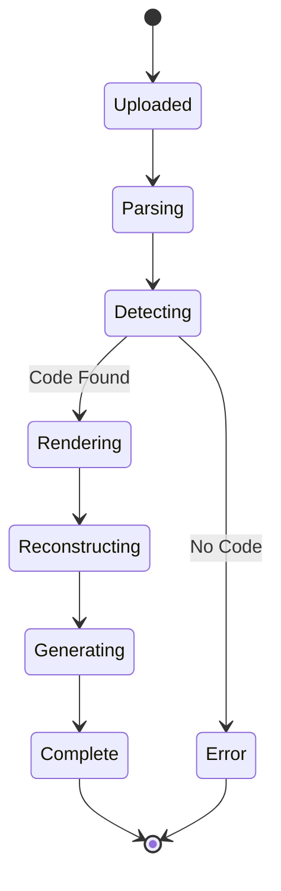

# Sample Document with Mermaid Diagrams

This is a test document that contains embedded Mermaid visualization code.

## Project Architecture

Here's a simple flowchart showing our system architecture:

## User Flow

The following sequence diagram illustrates the user interaction flow:

## System States

Here's a state diagram showing document processing states:

## Conclusion

This document demonstrates the proper use of Mermaid diagrams in Markdown. After processing, all code blocks should be replaced with rendered images.
